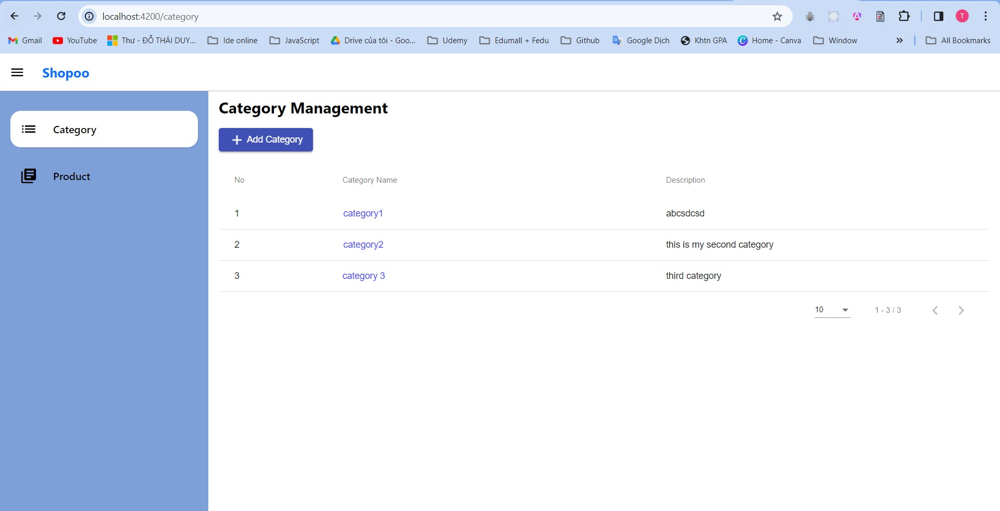

# **Shopoo**
Ecommerce website based on viewing products associated with category. There are two website: one for admin and one for customer.

## **Contents**
### [Tech stack](#tech-stack)
### [Folder Structure](#structure)
### [Environment Installation](#install)
### [How to run system](#run)
### [Completed functionality](#done)
### [Image Demo](#demo)

## **Tech stack**<a name="tech-stack"></a>
- Language: C#, Javascript, Typescript, HTML, CSS.
- Framework: ASP.Net Core, Angular, NUnit.
- Templates: ASP.NET Core Web MVC, ASP.NET Core Web API, Class Library, NUnit Test Project.
- Database: SQL Server.
- Techniques: TagHelpers, Razor Pages, ViewComponent, Unit Test.

## **Folder Structure**<a name="structure"></a>
### DataCommon
- Contains shared models like Entity, RequestModel, Response Model,... which is used in **Backend project** and **Customer project**.
- Template: Class Library.
### ShopooSystem
- Backend project.
- Contains all API of the system, handle business logic related.
- Template: ASP.NET Core Web API.
### ShopooCustomerApp
- Customer project.
- A customer site for viewing product and category.
- Template: ASP.NET Core Web MVC.
### ShopooAdminApp
- Admin project.
- A dashboard for managing product and category.
- Template: Angular
### UnitTest
- UnitTest project.
- Contains all unit test for common components: Controllers (Backend project), Services (Backend and Customer project), ViewComponent (Customer project),...
- Template: NUnit Test project.

## **Environment Installation**<a name="install"></a>
- Target Framework: .Net Core 6.0, Angular 14, Nodejs 18
- IDE: Visual Studio 2022, SQL Server 2019, Visual Studio Code

## **How to run system**<a name="run"></a>
### Backend Project (ShopooSystem):
1. Update information about your connection string with SQL Server in *appsettings.json*.
2. Open Package Manager Console and run command ``` update-database ``` in order to initialize database and tables in SQL Server.
3. Press **Ctrl + F5** or **F5** to start application. 

### Customer Project (ShopooCustomerApp):
1. Press **Ctrl + F5** or **F5** to start application. 

### Admin Project (ShopooAdminApp):
1. Open new terminal and install node_modules with command ``` npm i --force ```.
2. Start application with command ``` npm start ``` or ``` ng serve ```.

### Unit Test project (UnitTest):
1. Open *Test Explorer* by *View -> Test Explorer* or *Ctrl + E,T*
2. Click *Run* button to run the test.

## **Completed functionality**<a name="done"></a>
- Create responsive layout for customer site and admin site.
- Present category list.
- Viewing products by category.
- View product detail.
- Manage category information (Name, Description).
- Add new category, Edit and Delete category (delete one category will delete all products associated with).
- Manage product information (Name, Category, Description, Price, Images, CreatedDate, UpdatedDate).
- Add new product, Edit and Delete product.
- Upload and update image of a product.
- Having Unit test for common components like Controllers, Services, ViewComponent.

## **Image demo**<a name="demo"></a>
### Backend project
<div>

</div>

### Customer project
<div>

</div>
<div>

</div>

### Admin project
1. Category Management
<div>

</div>
<div>

</div>
<div>

</div>

2. Product Management
<div>

</div>
<div>

</div>
<div>

</div>
<div>

</div>